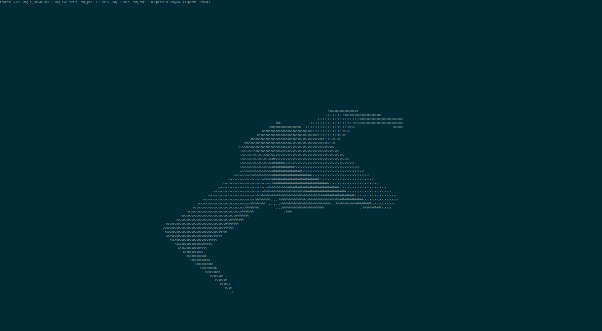

# 3D ASCII Renderer in the Terminal
This project is a 3D ASCII renderer that runs in the terminal, utilizing the ncurses library for graphical output. It allows users to view 3D models represented in ASCII art, giving them a simple, unique and retro visual experience.

## Features

* ASCII Rendering: The renderer takes 3D mesh, and displays it in the terminal using ASCII characters.
* Lighting and Shading: The renderer supports basic lighting and shading techniques, in order to view the 3D object clearly.
* User intereaction: The user can control the camera and rotation of the object presented.
* Model loading: The project allows the user to load their own object and view it in the terminal.

## Installation

1. Clone the repository: `git clone https://github.com/ShakedAp/ASCII-renderer.git`.
1. Make sure the prerequisites are installed. The project relies on `pthread` and `ncurses`.
1. Compile the project using the Makefile: `make all`. Change the compiler to your compiler of choice.
1. Change the terminal font to be **monospace** font, and scale it down as much as possible, while being in full-screen.
1. Run the renderer `./bin <mesh-path>` (mesh is optional).

## Usage

1. `WASD` to move the first person camera
2. `arrow-keys` to change the camera angle
3. `q` slow down the rotation of the object
4. `e` speed up the rotation of the object
5. `ctrl-c` to quit the program

#### Mesh Creation
The mesh need to be made only from traingles. Take a look at the example meshes in `/meshes`  
Example process to export a mesh from blender:
1. Create an object in blender, make sure it is in the correct scale.
2. Click on `File -> Export -> Wavefront (.obj) `
3. In `Export OBJ` uncheck all of the options, but leave `Triangulate faces`
4. Set `Forward` to be `Z forward`
5. Export the object

## Screenshots
Utah Teapot, containing around 10k triangles:

A simple ship object, containing much less triangles and a larger font. (Larger font -> less pixels -> lower quality):

## What's Next?
This project is not completely finished, but it is in a working state. I don't think it will be continued. The rasterizing and rendering can be improved, for example by adding face culling and clipping, improving the drawing algorithms, adding better lighting, adding colors... This renderer can become a fully functional renderer to be used for games and etc.  
Maybe I'll come back to it in the future :).
 